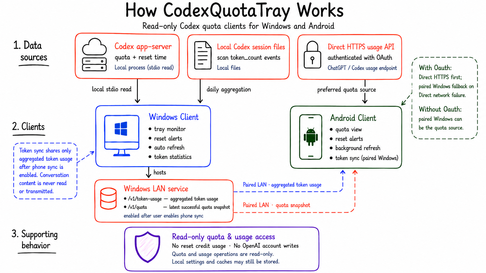

# CodexQuotaTray

[English](README.md) | [简体中文](README.zh-CN.md)

CodexQuotaTray is a pair of lightweight, read-only Codex quota clients. They do not use Electron,
WebView, or web scraping.

## How it works

| Client | Data source | Entry point |
| --- | --- | --- |
| Windows | Quota: local `codex app-server --stdio`; tokens: daily aggregates from local Codex sessions | C# / WinUI 3 in `windows/` |
| Android | With OAuth, the Android app uses its private OAuth credentials and the Direct HTTPS usage API; without OAuth but with a paired Windows device, it can read Windows LAN quota snapshots | Kotlin / Jetpack Compose in `android/` |

> **Read-only boundary:** Both clients only read quota data and reset times. They do not consume reset
> credits or perform account writes.

On Windows, local Codex session `token_count` events are aggregated daily. Aggregated usage is shared
with Android only after the user explicitly enables phone synchronization; conversation content is never
read or transmitted.

When OAuth is available, Android prefers Direct HTTPS and uses the paired Windows fallback only after a
Direct network failure. Without OAuth but with an existing Windows pairing, it can read the latest
successful Windows quota snapshot and run a Windows-only refresh. Without either source, no quota data is
available.

## Downloads

Official Windows and Android packages are available from
[GitHub Releases](https://github.com/DDJang/CodexQuotaTray/releases):

- Windows installer: `CodexQuotaTray-<version>-setup.exe`
- Windows portable: `CodexQuotaTray-<version>-win-x64.zip`
- Android APK: `CodexQuotaTray-Android-v<version>.apk`

Use the platform-specific `SHA256SUMS.txt` from the corresponding release to verify downloaded files.
Versioning, automatic updates, and artifact/release rules are defined in the [release documentation](docs/RELEASE.md).

## Code signing policy

See the [code signing policy](docs/CODE_SIGNING.md).

## Development entry points

- [WinUI build, run, and verification](windows/README.md)
- [Android build, run, and verification](android/README.md)
- [Product requirements](docs/PRD.md)
- [Architecture](docs/TECH_DESIGN.md)
- [Protocol contract](docs/API_CONTRACT.md)
- [Privacy boundaries](docs/PRIVACY.md)
- [Dependencies and licenses](docs/DEPENDENCIES.md)
- [Release process](docs/RELEASE.md)
- [Windows roadmap](docs/ROADMAP.md)
- [Android roadmap](docs/ANDROID_ROADMAP.md)
