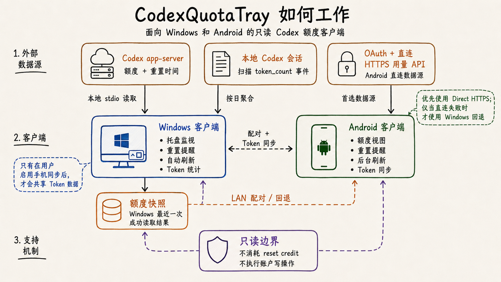

# CodexQuotaTray

[English](README.md) | [简体中文](README.zh-CN.md)

CodexQuotaTray 是一组轻量、只读的 Codex 额度客户端，不使用 Electron、WebView 或网页抓取。

## 工作原理

| 客户端 | 数据来源 | 入口 |
| --- | --- | --- |
| Windows | 额度：本机 `codex app-server --stdio`；Token：本机 Codex session 日聚合 | C# / WinUI 3，位于 `windows/` |
| Android | 有 OAuth 时使用 App 私有 OAuth + Direct HTTPS usage API；无 OAuth 但已配对 Windows 时可直接使用 Windows LAN 额度快照 | Kotlin / Jetpack Compose，位于 `android/` |

> **只读边界：** 两端只读取额度和重置时间，不消费 reset credit，也不执行账户写操作。

Windows 会从本地 Codex session 的 `token_count` 事件做日聚合；只有用户明确启用手机同步后，才会
向 Android 分享聚合数据，不会读取或传输对话正文。

有 OAuth 时，Android 优先使用 Direct HTTPS；只有 Direct 网络失败后才回退到已配对的 Windows。
没有 OAuth 但已有 Windows pairing 时，可以读取 Windows 最近一次成功的额度快照并执行
Windows-only 刷新；两者都没有时，没有可用的额度数据源。

## 下载

Windows 和 Android 正式版本均从
[GitHub Releases](https://github.com/DDJang/CodexQuotaTray/releases) 下载：

- Windows 安装包：`CodexQuotaTray-<version>-setup.exe`
- Windows 免安装包：`CodexQuotaTray-<version>-win-x64.zip`
- Android APK：`CodexQuotaTray-Android-v<version>.apk`

使用对应 Release 中的平台 `SHA256SUMS.txt` 校验下载文件。版本、自动更新以及产物和发布规则见[发布文档](docs/RELEASE.md)。

## 代码签名政策

请参阅[代码签名政策](docs/CODE_SIGNING.md)。

## 开发入口

- [WinUI 构建、运行与验证](windows/README.md)
- [Android 构建、运行与验证](android/README.md)
- [统一产品需求](docs/PRD.md)
- [架构设计](docs/TECH_DESIGN.md)
- [协议合同](docs/API_CONTRACT.md)
- [隐私边界](docs/PRIVACY.md)
- [依赖与许可证](docs/DEPENDENCIES.md)
- [统一发布流程](docs/RELEASE.md)
- [Windows 路线图](docs/ROADMAP.md)
- [Android 路线图](docs/ANDROID_ROADMAP.md)
